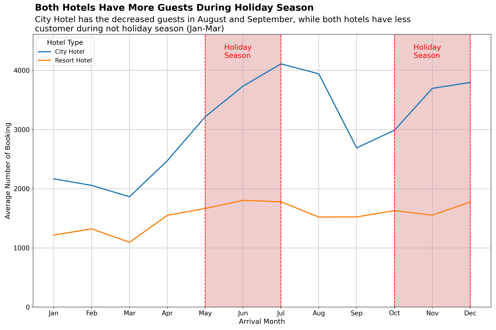
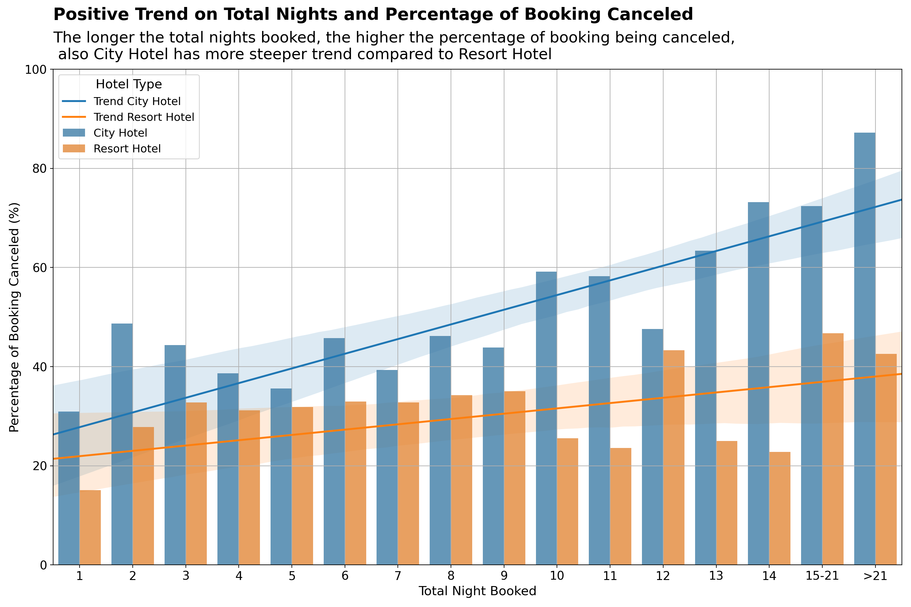
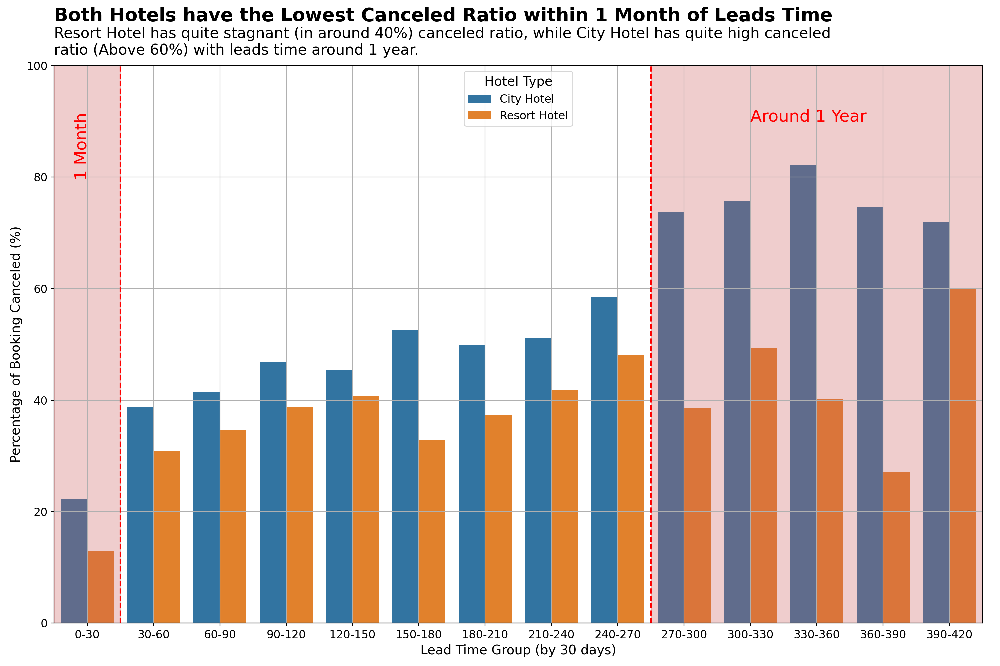

# Investigate Hotel Business using Data Visualization

## Project Description
This project investigates hotel business performance using **Python**, focusing on:
- Booking trends over time.
- Impact of **length of stay** on cancellation rates.
- Impact of **lead time** on cancellation rates.

The analysis uses `hotel_bookings_data.csv`, processed using **pandas** and **numpy** for data manipulation, and **matplotlib.pyplot** & **seaborn** for clear, communicative data visualization.

---

## Goals

- **Understand customer booking behavior** based on seasonality and lead time.  
- **Identify patterns and factors that influence cancellation rates** to assist in decision-making.  
- **Support hotel business strategy** with data-driven insights to increase occupancy and reduce cancellations.  
- **Practice exploratory data analysis (EDA) and visualization** for clear stakeholder communication.

---

## Tools Used

- **Python 3.x**
- `pandas`, `numpy` for data preprocessing.
- `matplotlib.pyplot`, `seaborn` for data visualization.

---

## Dataset Overview

**File:** `hotel_bookings_data.csv`  
Contains customer bookings for **City Hotel** and **Resort Hotel**, with key fields including:
- `hotel`, `arrival_date_month`, `lead_time`, `is_canceled`, `adr`, `stays_in_weekend_nights`, `stays_in_weekdays_nights`, etc.

> **Source**: Public sample dataset hosted on GitHub  
> [View Dataset on GitHub](https://github.com/denindrap23/Machine-Learning/blob/main/Investigate-Hotel-Business-using-Data-Visualization/hotel_bookings_data.csv)

---

## Data Preprocessing

- **Missing Data Handling:** Imputation and removal as appropriate.  
- **Data Cleaning:** Standardization of inconsistent categorical and numerical values.  
- **Column Selection:** Dropped irrelevant columns to optimize analysis focus.

---

## Analysis and Insights

### 1. Monthly Booking Analysis by Hotel Type

- **Insight:** Both hotels peak during **holiday seasons (May-July, Nov-Dec)**, while City Hotel drops in August and September.
- **Actionable:** Promotions can target low seasons (Jan-Mar, Aug-Sep) to increase occupancy.

---

### 2. Impact of Length of Stay on Cancellation Rates

- **Insight:** **Longer stays correlate with higher cancellation rates**, especially for City Hotel.
- **Actionable:** Consider non-refundable incentives or partial upfront payments for long-stay bookings.

---

### 3. Impact of Lead Time on Cancellation Rates

- **Insight:** Lowest cancellation rates occur within **1 month lead time**; cancellation rates increase with longer lead times, with City Hotel showing a higher increase.
- **Actionable:** Implement customer engagement strategies for long lead time bookings to reduce cancellations and manage revenue forecasting.

---

## Key Takeaways

- Booking volumes are highly **seasonal**, peaking during holidays.
- **Longer lead times and stays increase the probability of cancellations.**
- Hotels can **adjust marketing, pricing, and customer engagement strategies** based on these findings to optimize revenue and occupancy rates.

---

## Future Work

- Build **Machine Learning models to predict cancellations** based on guest behavior.
- Combine ADR, occupancy rates, and seasonality for **revenue forecasting**.
- Conduct geo-analysis for **location-based promotional strategies**.
