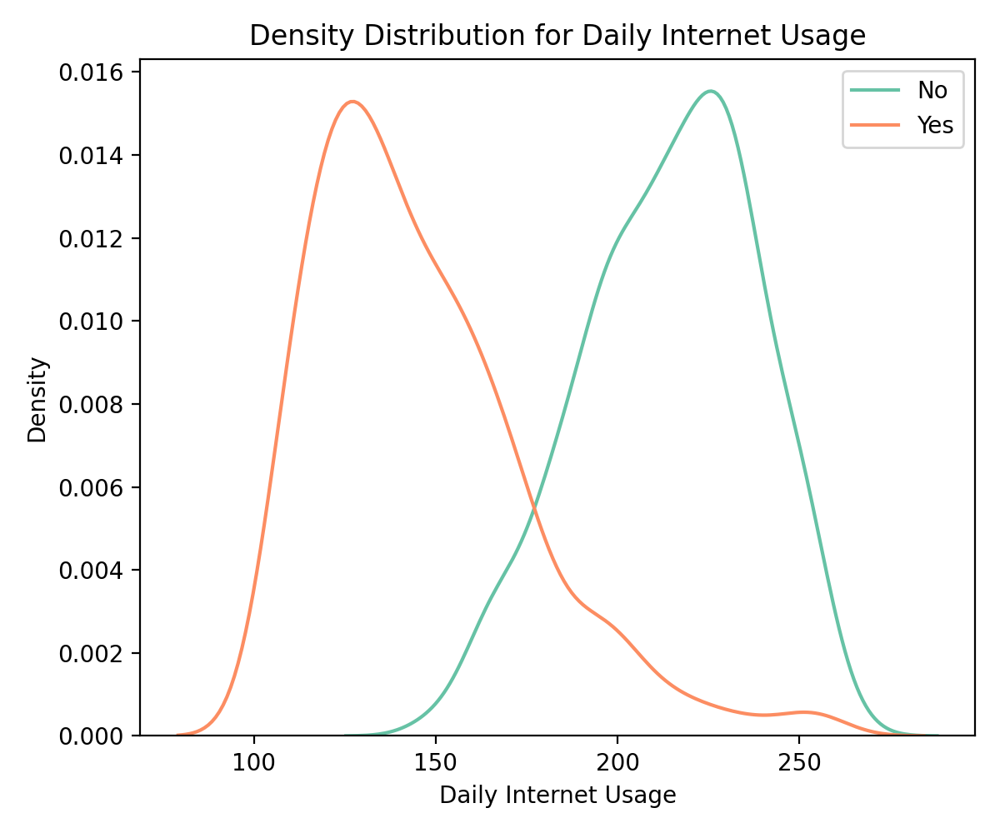

# Predict-Customer-Clicked-Ads-Classification by using Machine Learning

## Project Description

This project builds a **machine learning classification model** to predict whether a customer will **click on an advertisement** using behavioral and demographic data, helping businesses **optimize advertising costs and targeting** on digital platforms.

The project uses the **Clicked Ads Dataset** (sample shown above) containing:
- Daily Time Spent on Site
- Age
- Area Income
- Daily Internet Usage
- Gender
- Timestamp
- City, Province, Category
- Clicked on Ad (target)

> **Source**: Public sample dataset hosted on GitHub  
> [View Dataset on GitHub](https://github.com/denindrap23/Machine-Learning/blob/main/Predict-Customer-Clicked-Ads-Classification%20by%20using-Machine-Learning/dataset/Clicked%20Ads%20Dataset.csv)

---

## Objective

- Predict potential customers likely to click on advertisements.  
- Optimize advertising budgets by targeting high-potential users.  
- Enhance marketing campaign ROI by reducing spend on low-potential audiences.

---

## Tools Used

- **Python** (pandas, numpy, scikit-learn)
- **Visualization**: seaborn, matplotlib
- **Models**: Logistic Regression, KNN, Decision Tree, Random Forest, Gradient Boosting

---

## Project Pipeline

 1️. **Data Cleaning & Preprocessing**  
- Handle missing values, encode categorical features, adjust data types.

 2️. **Exploratory Data Analysis (EDA)**  
- Analyze ad click behavior across age, income, internet usage, and site activity.

3️. **Feature Engineering**  
- Create categorical encodings, extract time-based features if needed.

4️. **Model Training & Evaluation**  
- Train multiple classifiers, evaluate using accuracy, precision, recall, F1-score, confusion matrix.

5️. **Insights & Business Recommendations**  
- Determine actionable targeting strategies from the model and analysis.

---

## Exploratory Data Analysis

1. Clicked User Distribution and Distribution of Daily Time Spent on Site

| Clicked User Distribution | Distribution of Daily Time Spent on Site |
|--------|-------|
|  |  |

Users who clicked ads tend to spend **less time on the website** compared to those who did not click.

---

2. Internet Usage vs Age vs Clicks

| Internet Usage vs Clicks | Age vs Clicks |
|--------|-------|
|  |  |

- **Older users with low daily internet usage** are more likely to click ads.
- Younger users tend to have lower click rates despite high internet usage.

---

3. Internet Usage vs Time Spent on Site

| Internet Usage vs Time Spent on Site | Conclusion |
|--------|-------|
|  | Users with **High daily time spent on-site with very high daily internet usage** correlates with a lower likelihood of clicking on ads. |

---

## Machine Learning Evaluation

1. Model Result

| Model Result | Confusion Matrix |
|--------|-------|
|  |  |

**Logistic Regression, Decision Tree, and Random Forest** achieved the highest accuracy of 94%, with Logistic Regression demonstrating the highest recall (0.90) and precision (0.98), making it highly effective in identifying potential ad clickers while minimizing false positives. **Random Forest** demonstrated high precision (0.96) and recall (0.91), ensuring a balanced ability to identify potential clickers while minimizing false positives and false negatives. |

**Explanation:**

- **High accuracy and F1-score** indicate the model can effectively distinguish between users who will click and those who will not.  
- Slight imbalance in false negatives and false positives; acceptable for campaign targeting.  
- Enables **precise targeting and budget efficiency**.

---

## Key Insights

- **Daily Time Spent**, **Age**, and **Daily Internet Usage** are highly influential in predicting ad clicks.  
- Users with **higher daily internet usage but moderate site time** are more inclined to click ads.  
- Age group **25-45** shows a higher conversion potential.  
- The model can help **reduce ad spend on low-likelihood users** while focusing efforts on segments with a higher probability of conversion.

---

## Conclusion

- The available data indicates the presence of **two distinct user segments: high-class users and lower-class users**.
- **High-class users** are characterized by:
  - Frequent internet usage
  - Frequent visits to product websites
  - Relatively younger age
  - Higher income levels
- **Lower-class users exhibit the opposite characteristics.**
- Users from **lower economic segments tend to be more easily attracted to clicking on products in digital ads**.
- **Heavy internet users are more resistant to ads**, potentially due to high exposure and familiarity with digital advertising.
- **Older age groups emerge as a potential target market for digital advertising**, indicating an opportunity for more tailored ad strategies.

## Business Takeaways

- **Adopt Subtle Advertising Approaches**  
Use **unique and soft-selling methods** so that ads do not appear overtly commercial, especially for heavy internet users.

- **Leverage Mainstream Content for Broader Reach**  
Deploy **simple yet trending content** that sparks conversation to attract users in the lower-class segment effectively.

---

## Potential Impact

- **Increase in campaign ROI** by reducing wasted impressions and clicks on low-converting users.  
- **Enhanced customer targeting** resulting in higher engagement rates.  
- Potential **cost savings** by optimizing ad delivery and reducing ineffective impressions.
