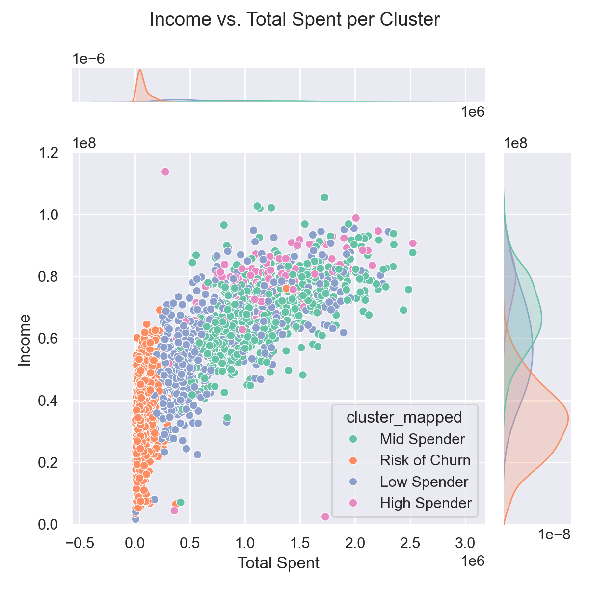

# Predict Customer Personality to Boost Marketing Campaign Using Machine Learning

## Project Overview

Understanding customer profiles and transactional behaviors is crucial for designing effective product sales strategies. This project utilizes **Machine Learning (K-Means Clustering)** to segment customers for targeted marketing, enabling companies to deliver the right treatment to customers based on their specific challenges, enhancing their experience, improving transaction satisfaction, and ultimately increasing sales performance.

---

## Dataset

- **Source:** `marketing_data.csv`
- Contains:
  - Customer demographic information (Age, Education, Marital Status, Income)
  - Purchasing behavior (product category spending)
  - Website visit and purchase channels
  - Response to marketing campaigns
These datasets simulate realistic employee data for demonstration and learning purposes, including employee demographics, job classifications, salary ranges, and exit details.

> **Source**: Public sample dataset hosted on GitHub  
> [View Dataset on GitHub](https://github.com/denindrap23/Machine-Learning/blob/main/Predict-Customer-Personality-to-boost-marketing-campaign-by-using-Machine-Learning/marketing_campaign_data.csv)

---

## Project Objectives

- To **understand customer profiles and purchasing behavior** for improved marketing strategies.
- To **segment customers using K-Means Clustering** for personalized marketing retargeting.
- To provide actionable recommendations that enhance customer experience and sales performance.

---

## Tools and Libraries

- **Python 3.x**
- `pandas`, `numpy` - Data processing and feature engineering
- `seaborn`, `matplotlib` - Data visualization
- `scikit-learn` - Clustering, PCA, t-SNE, scaling, evaluation

---

## Workflow

### 1. **Data Cleaning & Preprocessing**  
   - Handling missing values.
   - Encoding categorical features (`Marital_Status`, `Education`, etc.).
   - Feature engineering:
     - `Age`
     - `Total_Amount_Spent`
     - `Conversion Rate`
   - Scaling numerical features using `StandardScaler` for clustering.

### 2. **Exploratory Data Analysis (EDA)**  
   - Analyzing distributions of `Income`, `Age`, `Total Amount Spent`, and `Conversion Rate`.

| Income vs Spent | Income vs Conversion Rate | Conversion Rate vs Spent |
|-----------------|----------|---------------|
|  |  |  |

| Age Analysis |
|-----------------|
|  |

### 3. **Data Modelling: Clustering (K-Means)**  
   - Using **Elbow Method** to determine the optimal number of clusters.
   - Applying K-Means clustering and appending cluster labels to the dataset.

| Data Modelling: K-Means Clustering |
|-----------------|
|  |

### 4. **Model Evaluation**  
   - **Silhouette Score** for cluster validation.    
   - **PCA** and **t-SNE** for 2D cluster visualization.

| Silhoutte Score | PCA | t-SNE |
|-----------------|-----------------|-----------------|
|  |  |  |

### 5. **Customer Personality Analysis**  
   - Analyzing each cluster’s profile:
      - **Risk of Churn:** Moderate-to-high spending but low visit frequency; needs retention-focused treatment.
      - **Low Spender:** Low spending; requires educational campaigns to increase engagement.
      - **Mid Spender:** Moderate spending; potential for upselling through targeted promotions.
      - **High Spender:** High income and spending; ideal for loyalty programs.
   - Reviewing spending, income, web visits, and conversion rates per cluster.

| Users Cluster | Income vs Total Spent |
|-----------------|-----------------|
|  |  |

| Income per Cluster | Spent Cluster per Cluster |
|-----------------|-----------------|
|  |  |

| Total Visit per Cluster | Deal Puchased per Cluster | Conversion Rate per Cluster |
|-----------------|-----------------|-----------------|
|  |  |  |

  - Insight
    - Low Spender:
      This segment primarily consists of older adults (>55 years) and middle-aged adults (36-55 years), most of whom are married with one child. They visit the website relatively frequently, ranking as the second most active group after Cluster 1, with a median of 5 visits per month. Despite this, they actively seek promotions, using around two promotions per person per month (median). However, this group has the second lowest total annual income and spending among all clusters, with annual income at IDR 57 million and annual spending at IDR 506K.

    - Risk of Churn:
      This segment represents the largest user group with 900 customers, dominated by middle-aged adults (36-55 years), mostly married with one child.
They have the lowest monthly income and spending, with annual income at IDR 33.4 million and annual spending at IDR 57K.
Interestingly, they visit the website most frequently with a median of 7 visits per month. However, they rarely proceed with transactions or utilize promotions during purchases.
They also show low campaign responsiveness, with most visits being organic rather than driven by marketing initiatives.

    - Mid Spender:
      This segment is mainly comprised of older adults (>55 years) and middle-aged adults (36-55 years), predominantly married with 0-1 children.
They hold the second highest total annual income and spending among all clusters, with annual income at IDR 68 million and annual spending at IDR 1.1 million.
Although they visit the website less frequently, this group responds most actively to campaigns and utilizes promotions most frequently, with an average of 3 promotions used per person per month.

    - High Spender:
      This is the smallest user group with 137 customers, dominated by older adults (>55 years) and middle-aged adults (36-55 years), most of whom are single and without children.
They exhibit the highest annual income and spending across all clusters, with annual income at IDR 80 million and annual spending at IDR 1.2 million.
While many in this cluster are non-organic visitors driven by campaigns, they use promotions the least compared to other clusters.
This segment has the highest conversion rate for purchasing products, and it is crucial for the business to retain this segment to maintain revenue performance.

### 6. **Recommendations & Potential Impact**  
  - Recommendation:
    - Continue monitoring transactions and retention for the High Spender segment. Focus on enhancing service quality to prevent churn within this high-value group.
    - For the Mid Spender segment, conduct further analysis to identify strategies for increasing transaction frequency through personalized recommendations. Additionally, analyze how to optimize promotion spending within this segment while ensuring continued purchases on our platform.
    - For the Low Spender and Risk of Churn segments, deeper analysis is needed to improve the visit-to-transaction conversion rate. While these groups exhibit high visit frequencies, they rarely convert to transactions. This may be due to product offerings or pricing misalignment with their expectations.

  - Potential Impact:
    - By maintaining close monitoring and retention efforts for the High Spender segment, the business can secure a potential GMV of IDR 176 million. For the Mid Spender segment, the potential GMV is IDR 66 million.
    - By optimizing promotions and reducing promotion spending for the Mid Spender segment (assuming a 50% reduction), the business could reduce costs by approximately IDR 50 million while maintaining transaction volumes.
